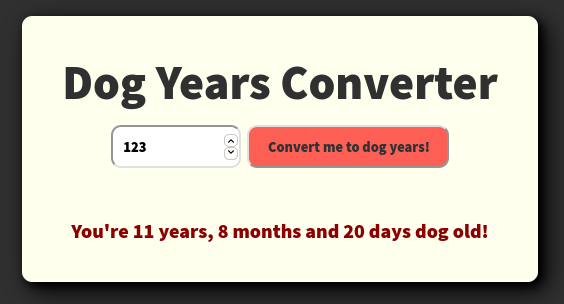

# Dog Years Converter

This simple vanilla Javascript application tells you how many dog years are you.

Application is automatically built, tested and deployed with [GitHub Actions](https://github.com/eldocbrown/dog-years-converter/actions) and can be used at this repository's [GitHub Pages](https://eldocbrown.github.io/dog-years-converter/)

Tests are built with [Jest](https://jestjs.io/), and pipeline is set to deploy the app on no tests failures.
